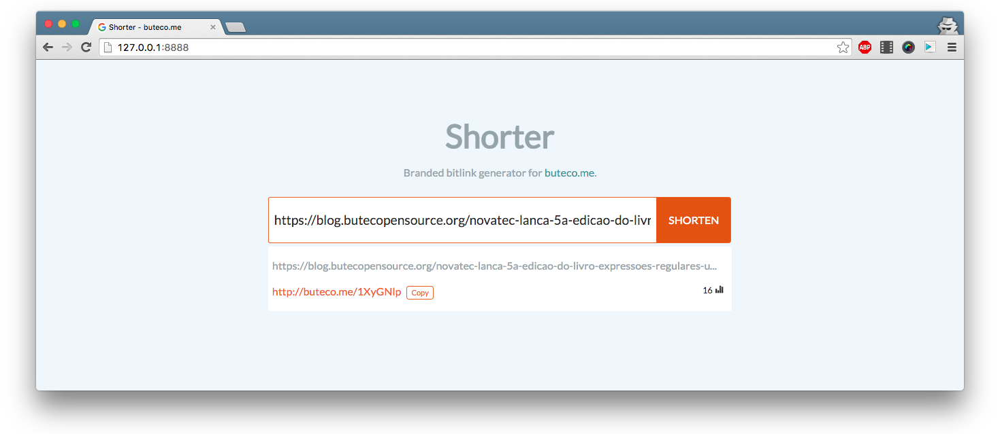

# Shorter  

Branded bitlink generator for Bitly.

## About

Easy way to create branded bitlinks with custom domain.

## Install

It works with Python 2.7+, 3.4+  and PyPy.

`pip install BitlyShorter`

## Running

Check `sample_config.yml` for configuration details.

Run `python -m shorter.app --config=my_config.yml`.

## Bitly token and branded domain

To get an access token visit [this page](https://bitly.com/a/oauth_apps).

To setup you own custom domain for Bitly, visit [this page](https://bitly.com/a/settings/advanced).
